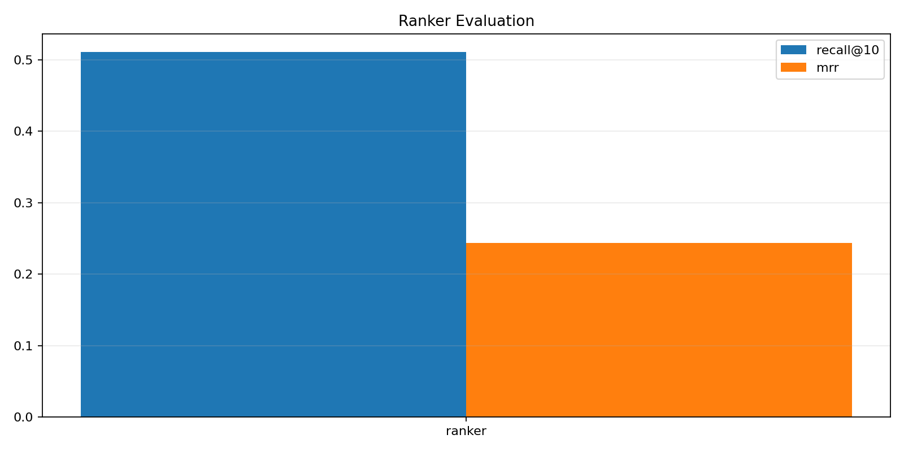

# Run Report

## Sync Expectations

- Remote H100 runs do not update your local VS Code automatically.
- Code changes need git push from one side and git pull on the other.
- Artifacts and logs are ignored by git in this repo, so they stay on the machine that created them unless you copy them back explicitly.

## Ranker Health

- Ranker: final eval_loss=0.1191.

## What To Look For

- Loss curves should stay finite. NaN or inf means the run is not trustworthy.
- A healthy ranker usually shows finite eval_loss and non-trivial recall@k.
- DOM grounding is only justified if element_accuracy or task success goes up enough to offset added latency.
- If DOM increases latency but not success, the top-k summary or ranker quality is the first thing to revisit.

## Charts



## Metric Snapshots

```json
{
  "ranker_metrics": {
    "eval_loss": 0.1190544068813324,
    "eval_runtime": 7.5088,
    "eval_samples_per_second": 300.183,
    "eval_steps_per_second": 18.778,
    "epoch": 2.0
  },
  "ranker_eval_metrics": {
    "split": "test_task",
    "evaluated_examples": 90,
    "recall@10": 0.5111111111111111,
    "mrr": 0.2436089940743238
  },
  "finetune_metrics": null,
  "base_eval_metrics": null,
  "dom_eval_metrics": null,
  "dom_lora_eval_metrics": null,
  "kernel_summary": null
}
```
