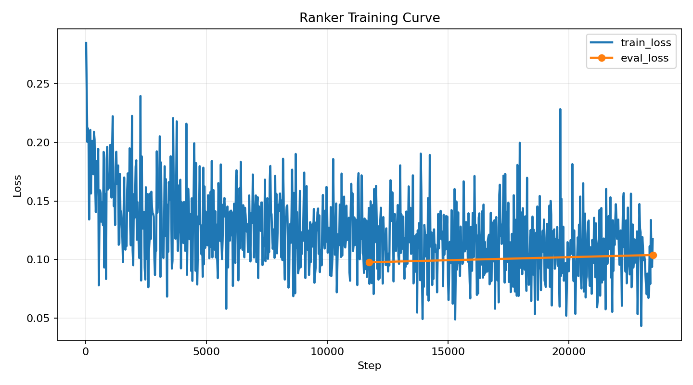
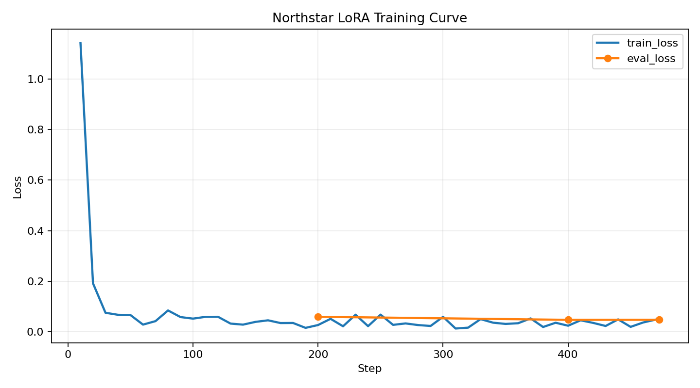
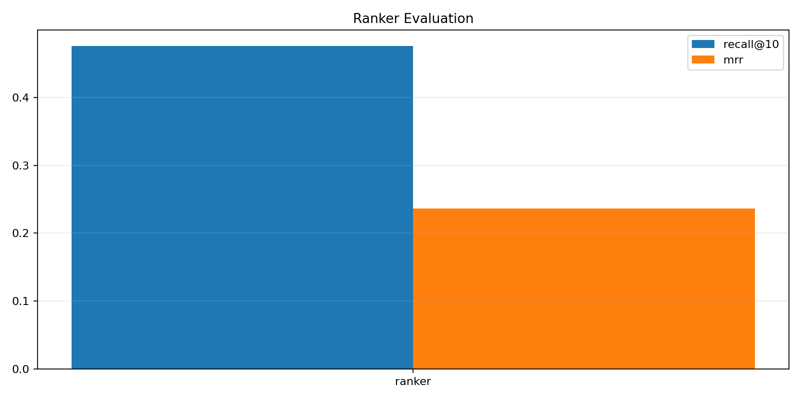
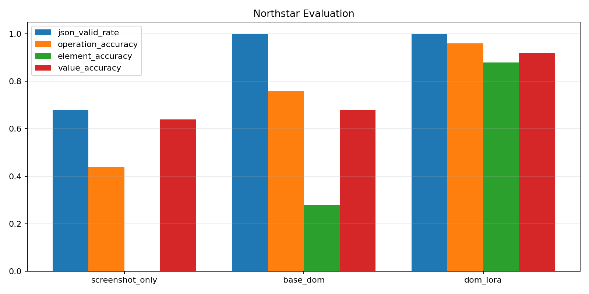

# Run Report

## Sync Expectations

- Remote H100 runs do not update your local VS Code automatically.
- Code changes need git push from one side and git pull on the other.
- Artifacts and logs are ignored by git in this repo, so they stay on the machine that created them unless you copy them back explicitly.

## Ranker Health

- Ranker: train loss range 0.0434 -> 0.2847.
- Ranker: eval loss range 0.0978 -> 0.1039.
- Ranker: final eval_loss=0.0978.

## Northstar Training Health

- Northstar LoRA: train loss range 0.0133 -> 1.1412.
- Northstar LoRA: eval loss range 0.0476 -> 0.0597.
- Northstar LoRA: final eval_loss=0.0478.

## Model Comparison

- DOM wrapper vs screenshot-only: element_accuracy delta=+0.2800.
- DOM wrapper vs screenshot-only: operation_accuracy delta=+0.3200.
- DOM+LoRA vs screenshot-only: element_accuracy delta=+0.8800.
- DOM+LoRA vs screenshot-only: operation_accuracy delta=+0.5200.

## What To Look For

- Loss curves should stay finite. NaN or inf means the run is not trustworthy.
- A healthy ranker usually shows finite eval_loss and non-trivial recall@k.
- DOM grounding is only justified if element_accuracy or task success goes up enough to offset added latency.
- If DOM increases latency but not success, the top-k summary or ranker quality is the first thing to revisit.

## Charts









## Metric Snapshots

```json
{
  "ranker_metrics": {
    "eval_loss": 0.09775405377149582,
    "eval_runtime": 2.0318,
    "eval_samples_per_second": 2858.557,
    "eval_steps_per_second": 89.576,
    "epoch": 2.0
  },
  "ranker_eval_metrics": {
    "split": "test_task",
    "evaluated_examples": 1257,
    "recall@10": 0.47573587907716786,
    "mrr": 0.236195104033856
  },
  "finetune_metrics": {
    "eval_loss": 0.047752320766448975,
    "eval_runtime": 213.7567,
    "eval_samples_per_second": 0.842,
    "eval_steps_per_second": 0.842,
    "epoch": 1.0
  },
  "base_eval_metrics": {
    "split": "test_task",
    "evaluated_examples": 25,
    "json_valid_rate": 0.68,
    "operation_accuracy": 0.44,
    "element_accuracy": 0.0,
    "value_accuracy": 0.64
  },
  "dom_eval_metrics": {
    "split": "test_task",
    "evaluated_examples": 25,
    "json_valid_rate": 1.0,
    "operation_accuracy": 0.76,
    "element_accuracy": 0.28,
    "value_accuracy": 0.68
  },
  "dom_lora_eval_metrics": {
    "split": "test_task",
    "evaluated_examples": 25,
    "json_valid_rate": 1.0,
    "operation_accuracy": 0.96,
    "element_accuracy": 0.88,
    "value_accuracy": 0.92
  },
  "kernel_summary": null
}
```
